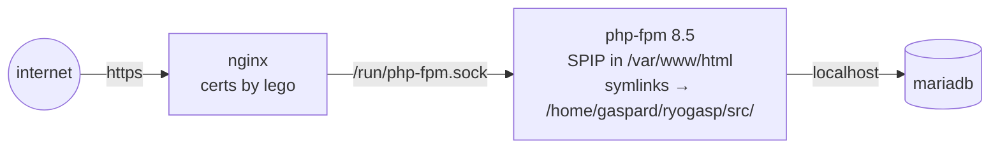

# production: ryogasp on bare-metal alpine linux + nginx

Development runs in docker on the mac (see `readme.md`). **Production runs without
docker**: Alpine Linux 3.24 with nginx, php-fpm 8.5, SPIP and MariaDB straight on the
host.

The `docker/` directory stays the single source of truth: `docker/Dockerfile` documents
the packages and the layout, and the nginx / php-fpm files in it are copied to the host
**as-is** — same rules in dev and in prod.



## 1. packages

The same list as `docker/Dockerfile`, plus *mariadb* and *lego*.

```sh
apk add nginx mariadb mariadb-client lego \
    git composer curl unzip su-exec tzdata \
    php85 php85-fpm \
    php85-bcmath php85-ctype php85-curl php85-dom php85-exif php85-fileinfo php85-gd \
    php85-iconv php85-intl php85-ldap php85-mbstring php85-mysqli php85-openssl \
    php85-pdo php85-pdo_mysql php85-pdo_sqlite php85-phar php85-posix php85-session \
    php85-simplexml php85-sodium php85-sqlite3 php85-tokenizer php85-xml php85-xmlreader \
    php85-xmlwriter php85-zip php85-zlib php85-pecl-apcu php85-pecl-imagick
ln -sf /usr/bin/php85 /usr/local/bin/php
for s in mariadb php-fpm85 nginx crond; do rc-update add "$s" default; done
```

## 2. users and rights

php-fpm and the nginx workers both run as `www-data` (Alpine already ships the group,
gid 82):

```sh
adduser -S -D -H -G www-data -h /var/www/html -s /sbin/nologin www-data
```

The code lives in gaspard's home. `www-data` needs to traverse into it (execute bit,
no listing):

```sh
chmod 711 /home/gaspard
```

## 3. the code → /home/gaspard/ryogasp

```sh
su - gaspard -c 'git clone https://github.com/gasp/ryogasp.git /home/gaspard/ryogasp'
```

`src/` must be writable by SPIP (uploads in `IMG/`, `config/`, `plugins/auto`,
`tmp/dump`) while gaspard keeps ownership for git. Group `www-data`, group-writable,
setgid on directories so new files inherit the group:

```sh
cd /home/gaspard/ryogasp
chown -R gaspard:www-data src
find src -type d -exec chmod 2775 {} +
find src -type f -exec chmod 664 {} +
```

## 4. SPIP core in /var/www/html

Same recipe as the Dockerfile: download the core, then symlink the site's directories
into it:

```sh
SPIP_VERSION=4.4.21
curl -fsSL "https://files.spip.net/spip/archives/spip-v${SPIP_VERSION}.zip" -o /tmp/spip.zip
mkdir -p /var/www/html
unzip -q /tmp/spip.zip -d /var/www/html
rm /tmp/spip.zip

cd /var/www/html
rm -rf IMG config plugins squelettes
ln -s /home/gaspard/ryogasp/src/IMG        IMG
ln -s /home/gaspard/ryogasp/src/config     config
ln -s /home/gaspard/ryogasp/src/plugins    plugins
ln -s /home/gaspard/ryogasp/src/squelettes squelettes
mkdir -p tmp local lib
ln -s /home/gaspard/ryogasp/src/tmp/dump   tmp/dump
chown -R www-data:www-data tmp local lib
```

## 5. spip-cli (the `spip` command)

```sh
git clone --depth 1 --branch 2.0.1 https://git.spip.net/spip-contrib-outils/spip-cli.git /opt/spip-cli
composer install --no-dev --working-dir=/opt/spip-cli
install -m 755 /home/gaspard/ryogasp/docker/spip /usr/local/bin/spip
```

(the wrapper cds to `/var/www/html` and drops root to `www-data`; it works unchanged
on the host)

## 6. mariadb

```sh
/etc/init.d/mariadb setup
rc-service mariadb start
mariadb -u root <<'SQL'
CREATE DATABASE spip CHARACTER SET utf8mb4;
CREATE USER 'spip'@'localhost' IDENTIFIED BY 'spippassword';
GRANT ALL PRIVILEGES ON spip.* TO 'spip'@'localhost';
SQL
```

`src/config/connect.php` is per-environment (gitignored): here the database host is
`localhost` (in docker it is `mysql`).

Restore the data: copy the latest dump into `src/tmp/dump/`, the media into `src/IMG/`,
then:

```sh
spip sql:dump:restore --name 2025-04-28
```

Plugins: download and unzip the four zips into `src/plugins/` (URLs in
`scripts/plugins.sh`), then:

```sh
spip plugins:activer -y -e breves squelettes_par_rubrique hasher comments
```

## 7. php-fpm

Replace the pool, keep Alpine's stock `/etc/php85/php-fpm.conf` (daemon + logs are the
distro's business):

```sh
cd /home/gaspard/ryogasp
cp docker/php/www.conf  /etc/php85/php-fpm.d/www.conf
cp docker/php/spip.ini  /etc/php85/conf.d/90-spip.ini
cat > /etc/php85/conf.d/99-local.ini <<'INI'
; in docker these come from the PHP_* environment (docker-entrypoint.sh)
max_execution_time = 60
memory_limit = 256M
post_max_size = 40M
upload_max_filesize = 32M
date.timezone = Europe/Paris
INI
rc-service php-fpm85 restart
ls -l /run/php-fpm.sock    # must belong to www-data
```

This moves the pool off Alpine's stock settings (`nobody` on `127.0.0.1:9000`) to
`www-data` on the socket. If other vhosts on the host reach php through a shared
snippet pointing at `127.0.0.1:9000`, repoint its `fastcgi_pass` at
`unix:/run/php-fpm.sock` too, or they lose php.

## 8. nginx

Alpine's layout: stock `/etc/nginx/nginx.conf`, one file per vhost in `http.d/`.
**Keep `http.d/default.conf`** as the `default_server` catch-all (scanners, bare-IP
hits, other names on the machine) — the site config therefore gives up the
`default_server` role it plays in dev.

A shared snippet gives every vhost the webroot where lego answers HTTP-01 challenges
(see step 9):

```sh
mkdir -p /etc/nginx/snippets
cat > /etc/nginx/snippets/acme.conf <<'NGINX'
# lego HTTP-01 webroot
location /.well-known/acme-challenge/ {
	root /var/lib/nginx/html;
}
NGINX
```

Copy the dev container's site config with three host adjustments — drop
`default_server` from the `listen` lines, set the real names, include the acme
snippet:

```sh
cd /home/gaspard/ryogasp
cp docker/nginx/fastcgi-spip.conf /etc/nginx/fastcgi-spip.conf
cp docker/nginx/ryogasp.com.conf  /etc/nginx/http.d/ryogasp.com.conf
vi /etc/nginx/http.d/ryogasp.com.conf
#   listen 80;  listen [::]:80;                 <- no default_server
#   server_name ryogasp.com www.ryogasp.com;
#   include /etc/nginx/snippets/acme.conf;      <- first line inside the server block
sed -i 's/^user nginx;/user www-data;/' /etc/nginx/nginx.conf
nginx -t && rc-service nginx restart
curl -sI -H 'Host: ryogasp.com' http://127.0.0.1/ | head -1    # HTTP/1.1 200 OK
```

## 9. https (lego)

lego keeps its state in `/etc/lego/` (`accounts/`,
`certificates/<first-domain>.crt|.key`); the account email lives in `/etc/lego/env`
(mode 600 — it can also hold DNS API credentials, see below):

```sh
mkdir -p /etc/lego
install -m 600 /dev/null /etc/lego/env
echo 'EMAIL=…' > /etc/lego/env
```

First issuance over HTTP-01 needs port 80 reachable from the internet (port-forward
on the router + the DNS A record pointing there). As root:

```sh
. /etc/lego/env
lego --accept-tos --email "$EMAIL" --path /etc/lego \
     --http --http.webroot /var/lib/nginx/html \
     -d ryogasp.com -d www.ryogasp.com run
```

When port 80 is not reachable, DNS-01 through the OVH API works from anywhere: add
`OVH_ENDPOINT=ovh-eu`, `OVH_APPLICATION_KEY=…`, `OVH_APPLICATION_SECRET=…`,
`OVH_CONSUMER_KEY=…` to `/etc/lego/env` and replace `--http --http.webroot …` with
`--dns ovh`.

Unlike `certbot --nginx`, lego never touches the nginx config — wire the certificate
by hand in `http.d/ryogasp.com.conf`. The existing server block becomes the 443 one;
a minimal port-80 block keeps the acme path and redirects the rest:

```nginx
server {
	listen 80;
	listen [::]:80;
	server_name ryogasp.com www.ryogasp.com;
	# respond to letsencrypt .well-known/acme-challenge
	include /etc/nginx/snippets/acme.conf;
	# otherwise, redirect to apex TLS
	location / {
		return 301 https://ryogasp.com$request_uri;
	}
}

server {
	listen 443 ssl;
	listen [::]:443 ssl;
	server_name ryogasp.com www.ryogasp.com;
	ssl_certificate     /etc/lego/certificates/ryogasp.com.crt;
	ssl_certificate_key /etc/lego/certificates/ryogasp.com.key;
	# force the apex domain:
	if ($host = www.ryogasp.com) {
		return 301 https://ryogasp.com$request_uri;
	}
	# ... the rest of the block unchanged
}
```

then `nginx -t && rc-service nginx reload`.

Renewal: a daily busybox-cron script renews anything due within 30 days and reloads
nginx — a no-op until `EMAIL` is set and a certificate exists:

```sh
cat > /etc/periodic/daily/lego <<'SH'
#!/bin/sh
# renew lego certificates due within 30 days; reload nginx to pick them up
. /etc/lego/env
[ -n "$EMAIL" ] || exit 0
lego --accept-tos --email "$EMAIL" --path /etc/lego \
     --http --http.webroot /var/lib/nginx/html \
     -d ryogasp.com -d www.ryogasp.com \
     renew --days 30 --renew-hook "rc-service nginx reload"
SH
chmod +x /etc/periodic/daily/lego
```

HTTPS is detected natively: nginx passes `$scheme`, `$https`, and `$server_port`
directly to SPIP through FastCGI.

Finally point SPIP at its public address (used in RSS feeds and absolute links):

```sh
spip config:ecrire adresse_site --valeur=https://ryogasp.com
```

## 10. check that everything works

```sh
bash /home/gaspard/ryogasp/scripts/smoke.sh https://ryogasp.com   # ~40 checks
rc-service nginx status && rc-service php-fpm85 status
tail -f /var/log/nginx/error.log
```

The first hits are slow while SPIP fills `tmp/` and `local/` (they start empty).
If php-fpm is down, nginx serves the static `squelettes/502.html` teapot page.

## 11. backups

`scripts/dump.sh` is written for docker; on the host call the tools directly
(`crontab -e` as root, busybox crond):

```cron
0 0 1,15 * * spip sql:dump:create --name $(date +\%Y-\%m-\%d) >/dev/null 2>&1
5 0 1,15 * * mariadb-dump --user=spip --password=spippassword spip | gzip -9 > /home/gaspard/ryogasp/src/tmp/dump/dump-$(date +\%Y-\%m-\%d).sql.gz
```

## upgrades

- **SPIP**: `spip core:mettreajour` then `spip core:maj:bdd` and `spip plugins:maj:bdd`
  (or download the new zip like in step 4 — the symlinks are yours, not SPIP's);
  refresh `src/config/spip/` from the new zip's `config/spip/` if it changed
  (SPIP >= 4.4 cannot boot without these files)
- **Alpine / nginx / php**: `apk upgrade`, then `rc-service php-fpm85 restart && rc-service nginx restart`
